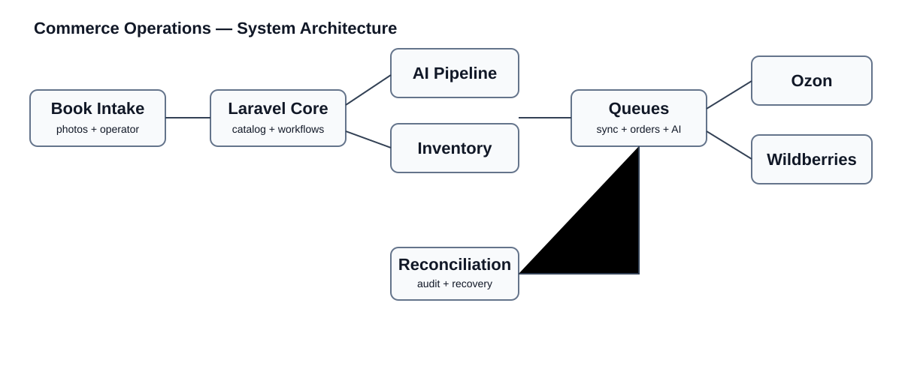
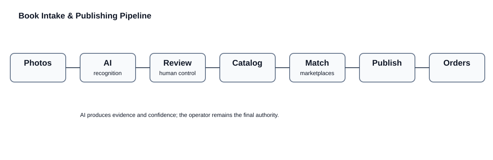
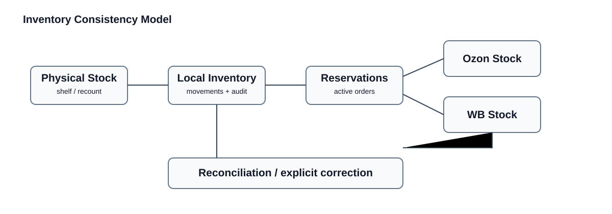

# Commerce Operations — Architecture Case Study

A technical case study of a production commerce operations platform for used-book inventory, AI-assisted cataloging, warehouse workflows, marketplace synchronization, orders, and reconciliation.

The production application is private. This repository documents selected architecture and reliability patterns without publishing marketplace credentials, customer data, internal infrastructure, production endpoints, or proprietary source code.

## Why this is more than a CRM

The system coordinates several representations of the same physical item:

- the book in the warehouse
- the internal catalog record
- physical shelf/location state
- local inventory
- marketplace product cards
- marketplace stock
- orders and reservations
- AI-derived metadata

The difficult engineering problem is keeping these representations consistent when external APIs are rate-limited, jobs retry, orders arrive asynchronously, physical stock is corrected, or marketplace data disagrees with local state.

## Core capabilities

- photo-based book intake
- AI-assisted recognition and metadata suggestions
- confidence and review workflow
- marketplace matching
- Ozon and Wildberries integrations
- product/card synchronization
- price and stock synchronization
- FBS order processing
- warehouse shelves and stock grouping
- inventory movement audit trail
- recount and spot-check workflows
- rate-limit-aware background jobs
- reconciliation and controlled recovery

## High-level architecture

## Operational pipeline

A newly received book moves through intake, recognition, review, cataloging, marketplace mapping, publication, and stock/order workflows. Expensive or unreliable operations run asynchronously.

## Inventory consistency

Physical stock, local inventory, reservations, and marketplace quantities are related but are not treated as the same state.

A marketplace response cannot silently overwrite warehouse truth, and a physical correction is recorded as an auditable movement rather than an unexplained number change.

See [Inventory](docs/inventory.md).

## Marketplace synchronization

Marketplace integrations are isolated behind services and background jobs.

The production system deals with:

- product/card synchronization
- stock updates
- price synchronization
- new orders
- order status
- reports
- webhooks
- retries
- partial failures
- API rate limits

Rate limiting is separated by API concern where appropriate, so throttling of a content or stock endpoint does not unnecessarily stop acquisition of new orders.

See [Marketplace integration](docs/marketplaces.md).

## AI-assisted cataloging

AI assists the operator instead of becoming an unquestioned source of truth.

The pipeline retains processing status, confidence, suggestions, source information, raw provider output where appropriate, and explicit failure state.

Failed recognition can be retried under bounded rules instead of looping indefinitely.

See [AI cataloging](docs/ai-cataloging.md).

## Reconciliation

The platform contains explicit operational recovery workflows.

Examples include:

- stock discrepancy snapshots
- inventory movement history
- order reconciliation
- shelf recounts
- spot checks
- delayed/retried marketplace jobs
- controlled recovery of stale work

Historical marketplace reports can be retained as evidence without automatically rewriting current inventory from ambiguous old data.

See [Reconciliation](docs/reconciliation.md).

## Scale example

A production Wildberries price synchronization pass processed 43,530 rows, updated 43,486 matched products, left 44 unmatched for review, and completed without processing errors.

This number is included as an example of the operational workload observed in the private production system; this repository does not contain the underlying commercial dataset.

## Reliability principles

- local domain state is explicit
- inventory changes are auditable
- external API failures do not erase pending work
- retries respect provider rate limits
- 429 responses honor retry timing
- unrelated marketplace API concerns can pause independently
- duplicate work is constrained where operations require uniqueness
- reconciliation is separate from normal request processing
- ambiguous state is surfaced for review rather than guessed

## Why this repository exists

Business software becomes difficult when one operation changes several systems at once.

This case study demonstrates how a Laravel application coordinates AI processing, warehouse state, marketplaces, orders, queues, and recovery workflows while keeping the production implementation private.
